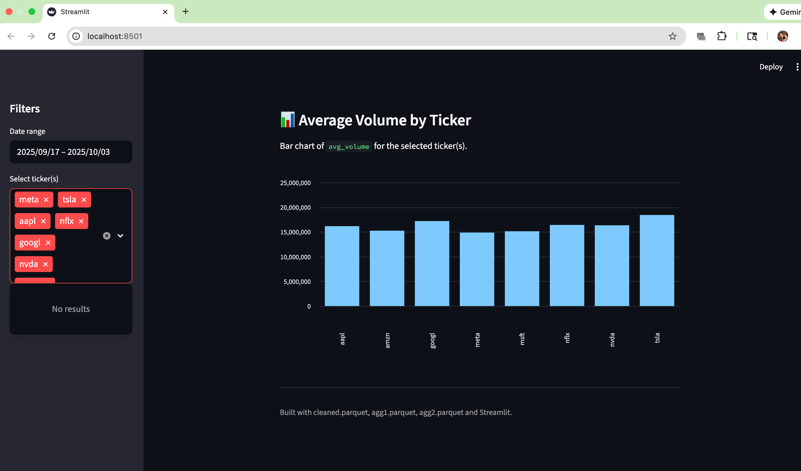

#  Stock Market Data Cleaning & Streamlit Dashboard

This project loads a stock market CSV file, cleans the data, creates aggregation tables, and visualizes the results using Streamlit.

## Steps to Run

### 1. Install dependencies
uv sync
### 2. Inspect the raw CSV
uv run python src/inspect_data.py 

### 3. Clean and normalize the data
uv run python src/data_clean.py
### This generates data/processed/cleaned.parquet
uv run python src/make_aggs.py
### Outputs:
data/processed/agg1.parquet (daily avg close by ticker)<br>
data/processed/agg2.parquet (average volume by ticker)
### 5. Launch the Streamlit dashboard
uv run streamlit run src/app.py

## 📁 Project Structure
```
stock-data-app/
├── data/
│   ├── raw/
│   │   └── stock_market.csv
│   └── processed/
│       ├── cleaned.parquet
│       ├── agg1.parquet
│       └── agg2.parquet
├── src/
│   ├── inspect_data.py
│   ├── data_clean.py
│   ├── make_aggs.py
│   └── app.py
├── screenshots/
│   ├── s1.png
│   ├── s2.png
│   └── s3.png
├── pyproject.toml
└── README.md
```


## 📸 Screenshots
Screenshots of the Streamlit dashboard are stored in the `screenshots/` folder.




